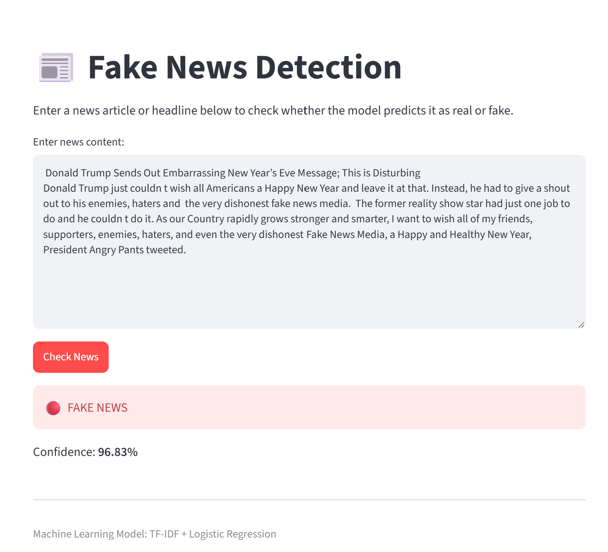

\# Fake News Detection Using Machine Learning


A machine learning web application that classifies news articles as \*\*Real News\*\* or \*\*Fake News\*\* using Natural Language Processing (NLP).


\## Project Overview


Fake news can spread quickly through online platforms and make it difficult for people to distinguish reliable information from misleading content.


This project uses machine learning and text processing techniques to analyze news content and predict whether an article is likely to be real or fake.


The trained model is integrated into a simple \*\*Streamlit web application\*\* where users can enter news content and receive a prediction with a confidence score.


\## Features


\- Fake and real news classification

\- Text preprocessing and cleaning

\- TF-IDF text vectorization

\- Logistic Regression classification

\- Prediction confidence score

\- Interactive Streamlit web interface

\- Model evaluation using accuracy, precision, recall and F1-score


\## Technologies Used


\- Python

\- Pandas

\- NumPy

\- Scikit-learn

\- TF-IDF

\- Logistic Regression

\- Streamlit

\- Joblib

\- Regular Expressions


\## Machine Learning Workflow


```text

News Dataset

&#x20;    ↓

Data Loading

&#x20;    ↓

Data Cleaning

&#x20;    ↓

Text Preprocessing

&#x20;    ↓

TF-IDF Vectorization

&#x20;    ↓

Train/Test Split

&#x20;    ↓

Logistic Regression

&#x20;    ↓

Model Evaluation

&#x20;    ↓

Save Model

&#x20;    ↓

Streamlit Web Application

&#x20;    ↓

Real / Fake Prediction


## Application Preview

### Fake News Prediction



### Real News Prediction

